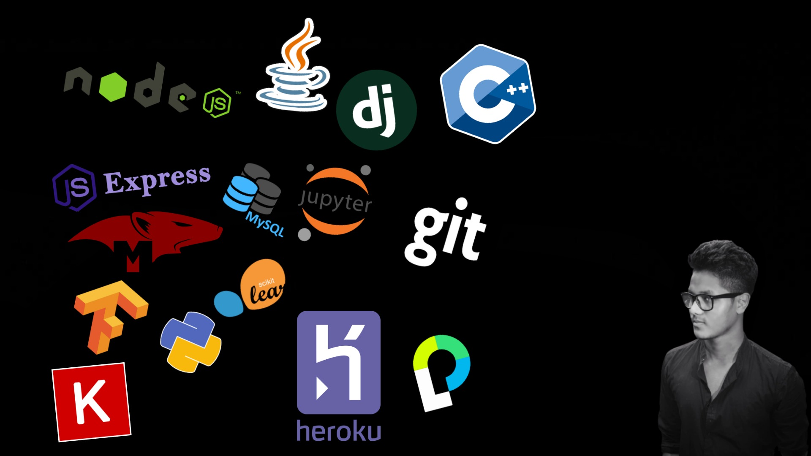
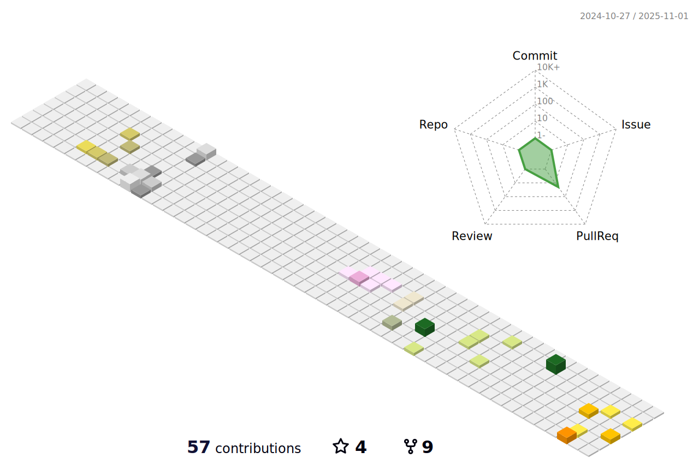

### Hello World! I am Rajeswar Sharma👋

<!--
**RajeswarSharma/RajeswarSharma** is a ✨ _special_ ✨ repository because its `README.md` (this file) appears on your GitHub profile.

Here are some ideas to get you started:
-->

- 🔭 I'm a Machine Learning enthusiast and a MERN stack Dev.
- 🌱 I’m currently working on Social Media Comment Sentiment Analyzer.
- 📫 Feel free to ping me on [LinkedIn](https://www.linkedin.com/in/rajeswar-sharma/)
- 👨🏻‍💻 Currently working as a Node JS dev. at [Frshr Tech](https://www.linkedin.com/company/frshrtechnologies/mycompany/)
- 📝Checkout my [Resume](https://drive.google.com/file/d/1JIUaD0xRl20NF3Qkv12vR7SVeWZWGEfy/view?usp=sharing)
- 💬 &nbsp; Ask me about **Machine Learning and Web development**
- 📧 My official **rajeswar.sh47@gmail.com**
- 🌐 My [Blogpost](https://projectwithpython.blogspot.com/)
- 📚 I Love to read about ancient technologies

  <h2 align="center"><code>📊SOME STATS</code></h4>

<!--  -->

  

